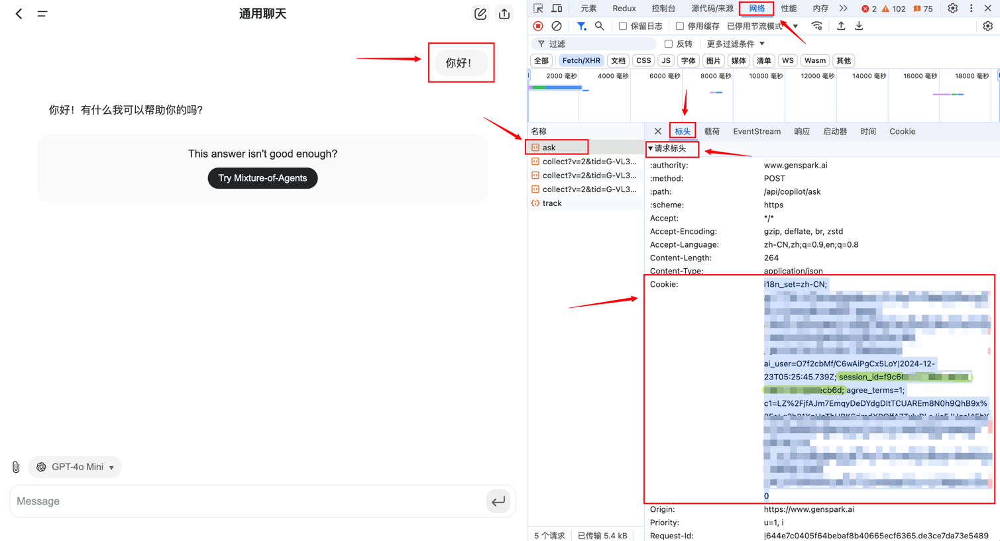

<p align="right">
   <strong>中文</strong> 
</p>

<div align="center">

# Genspark2API

_觉得有点意思的话 别忘了点个🌟_

</div>

## 功能

- [x] 支持流式输出
- [x] 支持识别图片/文件多轮对话
- [x] 支持文生图
- [x] 支持自定义请求头校验值(Authorization)
- [x] 支持cookie池(随机)
- [x] 可配置自动删除对话记录

### 接口文档:

略

### 示例:

略

## 如何使用

略

## 部署

### 基于 Docker-Compose(All In One) 进行部署

```shell
docker-compose pull && docker-compose up -d
```

#### docker-compose.yml

```docker
version: '3.4'

services:
  genspark2api:
    image: deanxv/genspark2api:latest
    container_name: genspark2api
    restart: always
    ports:
      - "7055:7055"
    volumes:
      - ./data:/app/genspark2api/data
    environment:
      - GS_COOKIE=******  # cookie (多个请以,分隔)
      - API_SECRET=123456  # [可选]接口密钥-修改此行为请求头校验的值(多个请以,分隔)
      - TZ=Asia/Shanghai
```

### 基于 Docker 进行部署

```docker
docker run --name genspark2api -d --restart always \
-p 7055:7055 \
-v $(pwd)/data:/app/genspark2api/data \
-e GS_COOKIE=***** \
-e API_SECRET="123456" \
-e TZ=Asia/Shanghai \
deanxv/genspark2api
```

其中`API_SECRET`、`GS_COOKIE`修改为自己的。

如果上面的镜像无法拉取,可以尝试使用 GitHub 的 Docker 镜像,将上面的`deanxv/genspark2api`替换为
`ghcr.io/deanxv/genspark2api`即可。

### 部署到第三方平台

<details>
<summary><strong>部署到 Zeabur</strong></summary>
<div>

> Zeabur 的服务器在国外,自动解决了网络的问题,~~同时免费的额度也足够个人使用~~

1. 首先 **fork** 一份代码。
2. 进入 [Zeabur](https://zeabur.com?referralCode=deanxv),使用github登录,进入控制台。
3. 在 Service -> Add Service,选择 Git（第一次使用需要先授权）,选择你 fork 的仓库。
4. Deploy 会自动开始,先取消。
5. 添加环境变量

   `GS_COOKIE:******`  cookie (多个请以,分隔)

   `API_SECRET:123456` [可选]接口密钥-修改此行为请求头校验的值(多个请以,分隔)(与openai-API-KEY用法一致)

保存。

6. 选择 Redeploy。

</div>


</details>

<details>
<summary><strong>部署到 Render</strong></summary>
<div>

> Render 提供免费额度,绑卡后可以进一步提升额度

Render 可以直接部署 docker 镜像,不需要 fork 仓库：[Render](https://dashboard.render.com)

</div>
</details>

## 配置

### 环境变量

1. `PORT=7055`  [可选]端口,默认为7055
2. `API_SECRET=123456`  [可选]接口密钥-修改此行为请求头(Authorization)校验的值(同API-KEY)(多个请以,分隔)
3. `GS_COOKIE=******`  cookie (多个请以,分隔)
4. `AUTO_DEL_CHAT=0`  [可选]对话完成自动删除[0:关闭,1:开启]

### cookie获取方式

1. 打开**F12**开发者工具
2. 发起对话
3. 点击ask请求，请求头中的**cookie**即为环境变量**GS_COOKIE**所需值
   
